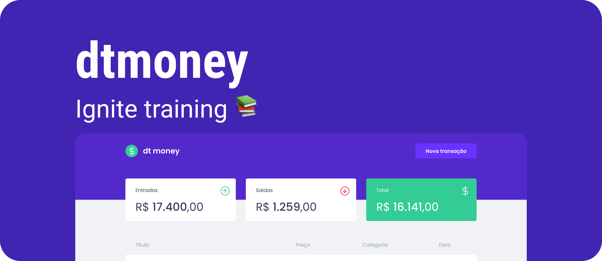

<!-- PROJECT SHIELDS -->
<!--
*** I'm using markdown "reference style" links for readability.
*** Reference links are enclosed in brackets [ ] instead of parentheses ( ).
*** See the bottom of this document for the declaration of the reference variables
*** for contributors-url, forks-url, etc. This is an optional, concise syntax you may use.
*** https://www.markdownguide.org/basic-syntax/#reference-style-links
-->

   

[![LinkedIn][linkedin-shield]][linkedin-url]

 

# 💰 dt money
Financial control application in general. In it, you can register new expenses or deposits, and have access to a dashboard containing important information about your finances such as all deposits, all withdrawals, and the general balance

# 🚀 Tech's

**React**: Framework used for the development of interfaces;

**Typescript**: Language used;

**Hooks**: Best and most modern way to control the life-cycle of React components;

**CSS-in-JS:** Using the styled-components lib to give "super powers" to the application's css;

**CSS global variables**: Usefull feature of CSS3;

**React-modal**: Lib for application modal control;

**MirageJS**: Excellent lib for mocking data on the front end

---

  
  <h4 align="center"><i>Application developed during Ignite bootcamp studies, powered by Rocketseat</i></h4>

 
 

<!-- MARKDOWN LINKS & IMAGES -->
<!-- https://www.markdownguide.org/basic-syntax/#reference-style-links -->
[license-shield]: https://img.shields.io/github/license/dpnunez/dt-money.svg?style=for-the-badge
[license-url]: MIT
[linkedin-shield]: https://img.shields.io/badge/-LinkedIn-black.svg?style=for-the-badge&logo=linkedin&colorB=555
[linkedin-url]: https://www.linkedin.com/in/daniel-n%C3%BA%C3%B1ez/
